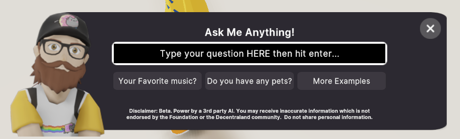

# Inworld.ai Example

This is an example scene to create AI NPCs backed by [Inworlds AI](https://inworld.ai/arcade) service

Deployed here 

Zone (InworldAiSdk6.dcl.eth)
[ https://play.decentraland.org/?realm=https%3A%2F%2Fworlds-content-server.decentraland.zone%2Fworld%2FInworldaisdk6.dcl.eth](https://play.decentraland.org/?realm=https%3A%2F%2Fworlds-content-server.decentraland.zone%2Fworld%2FInworldaisdk6.dcl.eth)

## Code

RemoteNpc (`src/aiNpc/npc/remoteNpc.ts`) is a new class that wraps the existing NPC object.  See for more details there [https://github.com/decentraland-scenes/dcl-npc-toolkit](https://github.com/decentraland-scenes/dcl-npc-toolkit).  

It adds the additional configuration for an NPC that talks to a remote server for the dialog.

StreamedMessage (`src/aiNpc/npc/streamedMsgs.ts`) is a utilty that implements an Iterator pattern to enable the scene to group messages from Inworld AI and use them with the NPC Dialog in a serial and squential way.

```
received stream of all Inworld AI messages all at once
show utterance1
player clicks next
show utterance2
player clicks next
```

## Customize


`src/aiNpc/npc/customNPCUI.ts` creates a custom 2D UI to enable the player to type a question for the NPC.  Customize this as you want




## Configuration

### Scene

You may want to configure endpoints for your local environment in the instance where you do not want or need to run Colyseus and login server locally

Found in `src/config.ts` there are variables in the following format so you could have configurations for multiple environments

```
const VARIABLE: Record<string, string> = {
  local: "local value",
  dev: "dev value",
  stg: "staging value",
  prd: "production value",
};
```

`ENV` - The environment for which values are to be used (local,dev,prod,etc.)

`COLYSEUS_ENDPOINT_URL` - Websocker endpoint

```
const COLYSEUS_ENDPOINT_URL: Record<string, string> = {
  local: "ws://127.0.0.1:2567",  //default local server port
  dev: "YOUR-DEV-ENDPOINT-HERE", 
  stg: "YOUR-STG-ENDPOINT-HERE",
  prd: "YOUR-PROD-ENDPOINT-HERE", 
};
 
```

### Should you make your own Inworld AI Scene and Characters

src/aiNpc/npc/npcSetup.ts

```
const myRemoteNPC = new RemoteNpc(
    {resourceName:"workspaces/{SCENE_NAME_HERE/characters/{CHARACTER_NAME_HERE}"}
    
    , new npc.NPC( .... )//YOUR NPC_OBJECT_FROM @dcl/npc-scene-utils
    
    //ADDITIONAL CONFIG FOR REMOTE NPC
    {
      npcAnimations:DOGE_NPC_ANIMATIONS,
      thinking:{
        enabled:true,
        model: new GLTFShape('models/loading-icon.glb'),
        offsetX: 0,
        offsetY: 2 ,
        offsetZ: 0
      }
      ,onEndOfRemoteInteractionStream: ()=>{
        showInputOverlay(true)
      }
      ,onEndOfInteraction: ()=>{
        //end of interaction
      }
    }
  }
```

## Try it out

#### Run Colyseus (Multiplayer server) (seperate tab)

Optional...if you only want to see the code in action no need run the proxy server.  The example scene is pointed our Genesis Plaza proxy server so you should be able to fully run these example scene without the server side.  Should you choose create your own scene and characters you will need to run your own server.


To create your own scene and characters follow the documentation found here [https://docs.inworld.ai/docs/intro](https://docs.inworld.ai/docs/intro).   Once you are finished run your local server.  

Instructions here [https://github.com/decentraland-scenes/inworlds-colyseus-proxy-service#readme](https://github.com/decentraland-scenes/inworlds-colyseus-proxy-service#readme)

Default endpoint can be found at http://localhost:2567/

In the Decentrlaand scene code Change in src/config.ts to point at your local

```
const ENV = "prd"
to
const ENV = "local"
```
> This will make is so your scene uses local: "ws://127.0.0.1:2567" from the COLYSEUS_ENDPOINT_URL varaible


Full instructions for running the proxy server can be found here Instructions here [https://github.com/decentraland-scenes/inworlds-colyseus-proxy-service#readme](https://github.com/decentraland-scenes/inworlds-colyseus-proxy-service#readme)

#### Run Decentraland Scene (seperate tab)

**Install the CLI**

Download and install the Decentraland CLI by running the following command:

```bash
npm i -g decentraland
```

**Previewing the scene**

Download this example and navigate to its directory, then run:

```
$:  dcl start
```

Any dependencies are installed and then the CLI opens the scene in a new browser tab.

**Scene Usage**

Click on the NPC to start a conversation, use E and F keys to choose options when prompted.

Learn more about how to build your own scenes in our [documentation](https://docs.decentraland.org/) site.

If something doesn’t work, please [file an issue](https://github.com/decentraland-scenes/Awesome-Repository/issues/new).


## Copyright info

This scene is protected with a standard Apache 2 licence. See the terms and conditions in the [LICENSE](/LICENSE) file.
